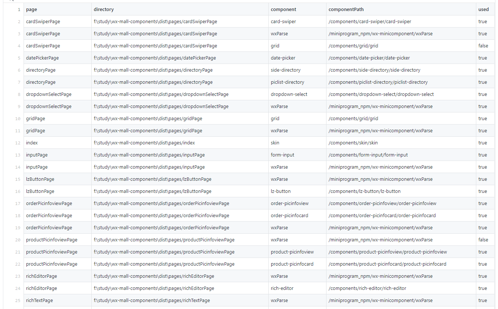

# 你的小程序项目的组件使用情况

## 前言

总所周知，微信小程序的包体积大小是有固定限制的，我们需要为小程序项目瘦身。

我在接触到一个庞大且混乱的小程序项目的初期，在编写新页面的时候，最让我头疼的就是我无法从这个庞大的项目中找到我要用到的公用组件，因为实在是太混乱了，大致总结了以下几个问题：

- 相同的组件以多种不同形式，出现在多个目录下面；

- 组件引入混乱，小程序分包不明确，子包内的组件竟然还存在相互引用的现象；（初步估计子项目间页面存在先后顺序，所以还没报错）

- 缺乏文档，每次新项目开发都是一次刀耕火种阶段，开发效率极其低下；

- 代码极其繁琐冗余，接手人员基本“查找代码2小时，修改代码5分钟”，实在看得头疼且影响心情。

## 分析

我需要搭建一个具有通用性，可维护性的组件库之前，我需要弄清楚下面几个问题：

- 每个页面到底引用了哪些组件？

- 每个组件的引用关系是怎样的，是否还存在相互引用的关系？

- 每个组件在页面的使用情况是怎样的，是否存在冗余现象？

因此，**查组件** 是我们搭建组件库之前必须要完成的准备工作，单靠人的肉眼去排查，很容易出现遗漏并且不太现实，于是我在本篇文章给大家演示了一下如何通过写脚本的方式，去将古老小程序项目的散落分布的组件逐一统计出来，并导出成 **csv** 的文件格式。

## 思路

我在这里简单阐述一下这次编码过程的思路：

1. 获取到了每个页面所对应的键值对组件数组列表；

2. 读取 wxml 文件内容字符串，将当前的字符串通过 html2json 工具库转换成 json 结构的对象；

3. 遍历组件数组列表，然后递归查找当前 wxml文件转化后的 json 对象，判断是否存在组件的标签字符，存在就输出为true，不存在就输出为false。

我们可以简单看看wxml文件转化后的json对象结构，子节点是以child数组的属性的形式存储在当前节点对象下面的，如下所示：

```json
{
  node: 'root',
  child: [
    {
      node: 'element',
      tag: 'div',
      attr: { id: '1', class: 'foo' },
      child: [
        {
          node: 'element',
          tag: 'h2',
          child: [
            { node: 'text', text: 'sample text with ' },
            { node: 'element', tag: 'code', child: [{ node: 'text', text: 'inline tag' }] }
          ]
        },
        {
          node: 'element',
          tag: 'pre',
          attr: { id: 'demo', class: ['foo', 'bar'] },
          child: [{ node: 'text', text: 'foo' }]
        },
        {
          node: 'element',
          tag: 'pre',
          attr: { id: 'output', class: 'goo' },
          child: [{ node: 'text', text: 'goo' }]
        },
        {
          node: 'element',
          tag: 'input',
          attr: { id: 'execute', type: 'button', value: 'execute' }
        }
      ]
    }
  ]
}
```

## 准备工作

1. 安装 **nodejs，npm**
2. 安装 **objects-to-csv** 包（将object对象数组导出成csv）
3. 安装 **html2json** 包（用来将wxml结构解析为json对象）

## 编码

### 1. 获取当前目录下的所有文件

读取当前目录，如果当前目录下的文件格式还是目录结构，递归执行本身，继续获取当前的目录下所有文件。

```js
/**
 * 获取目录下的所有文件名
 * @param {*} directory 
 */
const getAllFiles = (directory) => {
  let result = []
  const files = fs.readdirSync(directory)
  for (let item of files) {
    const path = directory + '/' + item
    const isDir = fs.statSync(path).isDirectory()
    if (isDir) {
      result = [...result, ...getAllFiles(path)]
    } else {
      result.push(path)
    }
  }
  return result
}
```

### 2. 过滤出需要分析的wxml，json文件

因为我们需要对引入的组件做分析，而页面下的 **json** 文件的 **usingComponents** 属性是我们页面引入组件的入口配置对象，因此我们要从中获取到 **json** 文件来分析。最后得到的就是每个 **wxml** 页面及其对应的 **components** 键值对数组。 

```js
/**
 * 过滤出需要统计的文件数组
 * @param {*} allFiles 需要过滤的文件数组
 * @param {*} fileTypes 需要过滤的文件类型
 */
const getFilterFiles = (allFiles, fileTypes) => {
  const filterFiles = []
  for (let begin = 0, len = allFiles.length; begin < len; begin++) {
    const filePath = allFiles[begin]
    const [filename, dst] = getFileName(filePath)

    // 不是需要过滤的文件类型，这跳转下次循环
    if (!fileTypes.includes(dst)) {
      continue
    }

    for (let j = begin + 1; j < len; j++) {
      const mapFilePath = allFiles[j]
      const [mapFilename, mapDst] = getFileName(mapFilePath)

      if (filename === mapFilename && fileTypes.includes(mapDst)) {
        filterFiles.push({
          [`${dst}File`]: filePath,
          [`${mapDst}File`]: mapFilePath,
        })
        break;
      }
    }
  }
  return filterFiles
}
```

### 3. 获取wxml的json对象结构

```js
/**
 * 获取wxml文件的js表示对象
 * @param {*} filePath 
 */
const getFileJsonData = (filePath) => {
  const fileStr = fs.readFileSync(filePath, 'utf8')
  const fileJsonData = html2json(fileStr)
  return fileJsonData || {}
}
```

### 4. 递归页面组件数组，判断当前页面对象是否引入组件（是否存在某标签字符）

```js
/**
 * 判断当前页面是否引入该组件标签
 * @param {*} pageJsonData 
 * @param {*} tagName 
 */
const isWxmlImportComponent = (pageJsonData, tagName) => {
  if (!pageJsonData.child) return false
  
  tagName = tagName.toLowerCase()
  for (let item of pageJsonData.child) {
    // 判断标签名是否一致
    if (item.tag === tagName) {
      return true
    }

    // 递归判断子节点的标签
    if (item.child) {
      const flag = isWxmlImportComponent(item, tagName)
      if (flag) {
        return true
      }
    }
  }
  return false
}
```

这是这次分享的核心代码，从 html2json 对象解析出来的对象我们可以发现，如果父标签有子标签的话，会有一个 child 的数组属性，于是我们就要对父标签进行递归操作：

```js
// 递归判断子节点的标签
if (item.child) {
  const flag = isWxmlImportComponent(item, tagName)
  if (flag) {
    return true
  }
}
```

并且每个标签都会有一个 tag 的属性，属性值就是标签名，于是由此得知，如果当前传入的标签名如果和当前标签一样，就可以退出当前的查找流程：

```js
// 判断标签名是否一致
if (item.tag === tagName) {
  return true
}
```

### 5. 最后来看看完整的代码实现

```js
const path = require('path');
const { isWxmlImportComponent } = require('./tool/parseUtils');
const { getAllFiles, getFilterFiles, listComponents, getFileJsonData } = require('./tool/fileUtils');
const ObjectsToCsv = require('objects-to-csv');

(async function() {
  // 解析入口目录
  const entryDir = path.resolve(__dirname + '/../dist/pages')
  const allFiles = getAllFiles(entryDir)

  if (allFiles.length === 0) return

  const filterFiles = getFilterFiles(allFiles, ['wxml', 'json'])

  // 组装导出对象数组数据
  const pageWithComponents = filterFiles.reduce((acc, { jsonFile }) => {
    const current = path.basename(jsonFile, '.json')
    const currentDir = path.dirname(jsonFile)
    const components = listComponents(jsonFile) || []

    if (components.length == 0) {
      return [...acc, { 
        page: current, 
        directory: currentDir,
      }]
    } else {
      // 输入wxml地址，转化为json标签对象
      const fileJsonData = getFileJsonData(currentDir + `/${current}.wxml`)
      const childs = components.reduce((childAcc, { name, path }) => {
        const used = isWxmlImportComponent(fileJsonData, name)
        return [...childAcc, {
          page: current,
          directory: currentDir,
          component: name,
          componentPath: path,
          used: used ? 'true' : 'false',
        }]
      }, [])
      return [...acc, ...childs]
    }
  }, [])

  // 导出csv文件
  const csv = new ObjectsToCsv(pageWithComponents)
  await csv.toDisk(__dirname + '/component_status_stat.csv')
})()
```

## 导出文件效果



## 项目地址

项目地址：[https://github.com/csonchen/wx-mall-components](https://github.com/csonchen/wx-mall-components)

脚本文件地址：[https://github.com/csonchen/wx-mall-components/blob/master/shell/component-status.stat.js](https://github.com/csonchen/wx-mall-components/blob/master/shell/component-status.stat.js)

脚本导出文件地址：[https://github.com/csonchen/wx-mall-components/blob/master/shell/component_status_stat.csv](https://github.com/csonchen/wx-mall-components/blob/master/shell/component_status_stat.csv)


有需要的同学可以自行下载脚本文件，然后修改一下入口目录的路径，在本地用 node 命令执行脚本文件就可以跑起来了，这样就可以分析出你当前的小程序项目每个页面引用到的组件路径。

## 总结

关于本次对 **如何分析小程序项目引入组件** 的分享就到此结束了，这是我曾经接手一个老旧项目的时候所总结下来的一点小小经验；

当你要分析一个项目的时候，可以先通过编写脚本的方式去分析一下里面的代码逻辑，组件引入情况，这样你可以在不熟悉业务的前提下，对项目有一个整体的认知，为后期的项目优化提供一份资料作为参考。