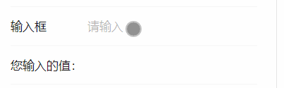
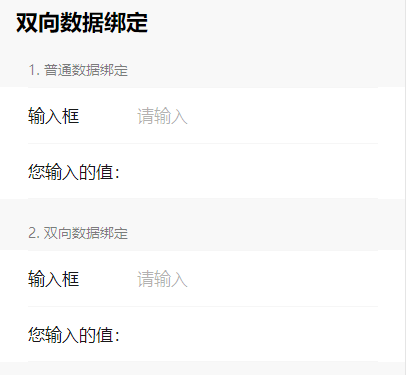
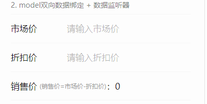
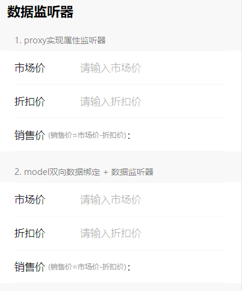

# 双向数据绑定 & 数据监听器

## 开篇

微信小程序在迭代更新的速度确实快，不知不觉间，又新添了不少新属性，使用文档越来越长，这次来分享一下近期开发项目时，使用到的一些新属性，直观感受就是 —— 写代码少了。

## 双向数据绑定

### 1. 使用文档： [https://developers.weixin.qq.com/miniprogram/dev/framework/view/two-way-bindings.html](https://developers.weixin.qq.com/miniprogram/dev/framework/view/two-way-bindings.html)

### 2. 示例效果：



### 3. 编码：

```html
// list.wxml
<!--双向数据绑定-->
<view class="weui-cells__group weui-cells__group_form">
  <view class="weui-cells__title">2. 双向数据绑定</view>
  <view class="weui-cells weui-cells_form">
    <view class="weui-cell weui-cell_active">
      <view class="weui-cell__hd"><label class="weui-label">输入框</label></view>
      <view class="weui-cell__bd">
        <input class="weui-input" model:value="{{value2}}" placeholder="请输入" placeholder-class="weui-input__placeholder" />
      </view>
    </view>
    <view class="weui-cell">您输入的值：{{value2}}</view>
  </view>
</view>
```

```js
// list.js
Page({
  value2: ''
})
```

**解析：例子里有一个文本输入框input标签，在原生的 `value` 属性前加上了 `model:` 的字样，底下放了一个文和输入框相同变量取值的普通标签，用来实时展示输入的文本值。**

**换句话说，只需要在标签属性前绑定了 `model:` 属性，就可以无需通过 `js` 代码去人为修改该属性绑定的变量值了（setData的方式），并且会同步影响到所有引用到该变量下的所有组件渲染。**

### 4. 过去 & 现在：

在项目里我分别写了两个例子，一个是传统的数据绑定，一个是通过 `model:` 的方式实现，如下图所示：



## 数据监听器

### 1. 使用文档：[https://developers.weixin.qq.com/miniprogram/dev/framework/custom-component/observer.html](https://developers.weixin.qq.com/miniprogram/dev/framework/custom-component/observer.html)

### 2. 示例效果：



### 3 编码：

```html
// vobserver.wxml
<view class="weui-cells__group weui-cells__group_form">
  <view class="weui-cells__title">2. model双向数据绑定 + 数据监听器</view>
  <view class="weui-cells weui-cells_form">
    <view class="weui-cell weui-cell_active">
      <view class="weui-cell__hd"><label class="weui-label">市场价</label></view>
      <view class="weui-cell__bd">
        <input class="weui-input" model:value="{{marketPrice}}" placeholder="请输入市场价" placeholder-class="weui-input__placeholder" />
      </view>
    </view>
    <view class="weui-cell weui-cell_active">
      <view class="weui-cell__hd"><label class="weui-label">折扣价</label></view>
      <view class="weui-cell__bd">
        <input class="weui-input" model:value="{{discount}}" placeholder="请输入折扣价" placeholder-class="weui-input__placeholder" />
      </view>
    </view>
    <view class="weui-cell">
      销售价 <text style="font-size: 12px;color: #999; margin-left: 5px;">(销售价=市场价-折扣价)</text>：{{salePrice}}
    </view>
  </view>
</view>
```

```js
Component({
  data: {
    marketPrice: '',
    discount: '',
    salePrice: '',
  },

  observers: {
    'marketPrice,discount'(marketPrice = 0, discount = 0) {
      const salePrice = marketPrice - discount
      this.setData({
        salePrice: salePrice < 0 ? 0 : salePrice
      })
    }
  },
})
```

**解析：这是商城应用最常见的一个价格计算功能 —— 计算销售价。计算方式为：销售价 = 市场价 - 折扣价。上面的这个例子采用了 `model:` 和 `observers` 两个属性相结合实现的：通过 `observers属性` 为市场价（marketPrice）和折扣价（discount）绑定监听函数，从而计算销售价（salePrice）。并且还能实时同步到内部属性（可以在Component组件内部拿到最新的 `marketPrice` 和 `salePrice`值。）**

### 4. 过去 & 现在：

在项目里我分别写了两个例子，一个是传统的数据监听绑定，以往我是通过 `proxy` 设置代理器来实现的；一个是通过 `model:` + `observers` 的方式实现，如下图所示：



## 结论：

**采用 `model:` 来实现微信小程序的数据双向绑定，如果是在页面层级使用的话，我们无需通过 `setData` 的方式来从新设置变量值，就可以同步到页面其余使用到该绑定变量的最新值；如果是在组件层级使用的话，好处就是不需要通过子组件内部 `triggerEvent` 的方式回调给父级一个方法回调，父级还得通过 `bind:event` 的方式重新设值。**

**无论是怎样使用，`model:`的方式使用大大减少了代码的编写量，而且还减少了逻辑链路的排查，不至于在各种`triggerEvent` 之间绕来绕去。**

**原理我就不献丑了，因为很多文章都有介绍过双向数据绑定的原理，在项目里面我也用一个例子简单模仿了一个，我估摸在小程序内部对 `model:` 绑定的变量统一存放在了由 `proxy` 绑定的对象里面，并且同步到了 `Page` 或者 `Component` 的`data`属性里面去，用户往后对绑定的变量的操作设值，都会交`proxy`进行代理执行，实时同步到`data`对象去。**