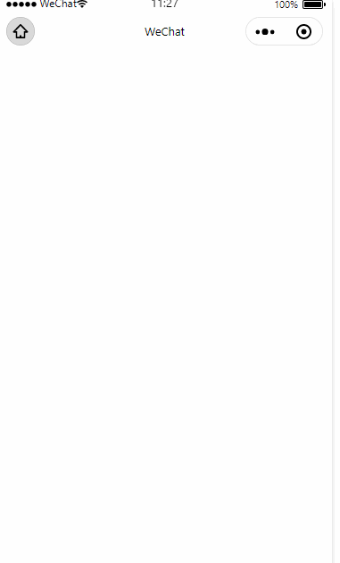

# 如何管理页面的多弹窗实现

最近在做一个小程序老项目的关于页面活动弹窗的修改，很多人一听到“老”字，汗毛竖起；当然我也不例外，我大概总结了一下，存在以下问题：

1. `js` 文件判断弹窗组件的逻辑代码嵌套多层 **if else** 判断，难以抽离；

2. `wxss` 文件关于处理弹窗组件的样式也是嵌套了多层 **wx:if** 判断，代码十分难看，字段判断嵌套过深，组件元素处理过于分散；

3. 编写弹窗初期没有做好前期规划，多种弹窗样式耦合其中，文件代码冗余过多，实在难以快速定位到合适的样式进行修改；

## 历史剖析

重构老代码最怕就是缺少个别的逻辑处理，导致在某一个条件下无法触发窗口弹出，出现bug；

重构毕竟是一个吃力不讨好的活儿，毕竟功能在线上运行了这么久没出问题，万一自己踩到雷区，接盘侠妥妥的了，背锅也是妥妥的了，还会惹来一身麻烦，更别提绩效了，这也是很多开发不愿意触碰老代码的最主要原因；

由于业务关系，本文不会用公司项目的代码作为例子，我会重新写一个例子以供大家参考，这是抽丝拔茧后的解决方案，希望可以帮助大家。

## 调研

我大概分析了一下，弹窗大致分为以下几种样式：

1. 通知弹窗 （纯文本）

2. 广告弹窗（大图）

3. 活动弹窗（即：自定义弹窗，样式不定，有可能是领优惠券，有可能是特定节日活动）

**小记：通知类型弹窗和广告大图弹窗是固定样式，可以作为一个组件单独实现；活动弹窗具有时效性，根据自己需要自行扩展实现。**

## 文字通知弹窗 + 广告大图弹窗实现

**场景描述：**

很多时候运营需要在同个页面顺序弹出多个窗口（可以参考拼夕夕，一打开首页疯狂弹窗，让人抓狂），于是，我这里用到了上一篇文章提到的 [发布订阅模式](https://developers.weixin.qq.com/community/develop/article/doc/000ec62c348068c9706aab4c356013) 实现，有需要的同学可以先去简单阅读一下。

1. **编写通用组件实现**

- **编写静态文件**

```html
// modal.wxml
<view class="modal" wx:if="{{ show }}">
  <view class="modalContent">
    <!-- 文本弹窗 -->
    <view class="textModal" wx:if="{{ type == 'text' }}">{{ value }}</view>
    <!-- 广告大图弹窗 -->
    <view class="picModal" wx:elif="{{ type == 'pic' }}">
      <image class="adImg" mode="widthFix" src="{{ value }}"></image>
    </view>
    <view class="customModal">
      <slot name="customModal"></slot>
    </view>
    <view class="flex flex-center" bindtap="hide">
      <image class="close-icon" src="/asserts/icon_bt_close_white.png" />
    </view>
  </view>
</view>
```

- **处理组件逻辑代码**

```js
// modal.js
const Event = require('../../designPatterns/observer');

Component({
  options: {
    multipleSlots: true,
  },  

  properties: {
  },

  data: {
    value: '',
    type: 'pic',
    show: false,
  },

  attached() {
    // 建立监听
    Event.listen('modal', (props) => {
      this.setData({
        ...props,
        show: true,
      })
    })
  },

  methods: {
    hide() {
      this.setData({ show: false })
      // 关闭弹窗通知回调页面，用于处理下一个弹窗继续弹出
      this.triggerEvent('hide') 
    },

    show() {
      this.setData({ show: true })
    }
  }
})

```

- **页面引用组件**

```json
// modalPage.json
{
  "usingComponents": {
    "modal": "/components/modal/modal"
  }
}
```

```html
// modalPage.wxml
<view>
  <modal bind:hide="triggerModal"/>
</view>
```

- **页面触发弹窗调用**

```js
// modalPage.js
const Event = require('../../designPatterns/observer');

Page({
  // 弹窗mock数据
  modalData: [
    {
      id: 1,
      level: 10, // 弹出的顺序，数字越大代表越先弹出
      type: 'text',
      value: '我是文本弹窗1',
    },
    {
      id: 2,
      level: 11,
      type: 'pic',
      value: '/asserts/OIP.jpeg'
    },
    {
      id: 3,
      level: 9,
      type: 'text',
      value: '我是文本弹窗2',
    }
  ],

  onLoad() {
    this.modalData = this.modalData.sort((prev, next) => -(prev.level - next.level))
    this.triggerModal()
  },

  triggerModal() {
    const targetModalList = this.modalData.splice(0, 1)
    if (targetModalList && targetModalList.length > 0) {
      // 继续触发弹窗
      Event.trigger('modal', targetModalList[0])
    }
  }
})
```

**小记：本着一次编码，幸福后代的原则，要是简单地把弹窗的管理交由各自页面单独处理，其实也是不美观的，在我看来，弹窗们应该是有一个管理员的角色，用来管理它们，由管理员去负责它们（排序，触发等动作），接下来我们在自定义弹窗组件编码中来看看应该如何实现**

2. **自定义活动弹窗**

- **多余代码不再复制累赘了，代码可以参考 `/components/modal/activityModal` 的相关文件**

- **弹窗管理类：ModalManage**

```js
// ModalManage.js
const Event = require('../designPatterns/observer');

class ModalManage {
  // 弹窗类型，用于触发特定弹窗
  modalType = {
    text: 'modal',
    pic: 'modal',
    activity: 'activityModal'
  }

  constructor(modalList) {
    // 初始化的时候需要排序，决定弹出优先级
    this.modalList = modalList.sort((prev, next) => -(prev.level - next.level))
  }

  triggerModal() {
    const targetModalList = this.modalList.splice(0, 1)
    if (targetModalList.length > 0) {
      const currentModal = targetModalList[0]
      // 发送弹窗通知
      Event.trigger(this.modalType[currentModal.type], currentModal)
    }
  }
}

module.exports = ModalManage
```

- **页面触发弹窗调用**

```js
const Event = require('../../designPatterns/observer');
const ModalManage = require('../../model/ModalManage');

Page({
  modalData: [
    {
      id: 1,
      level: 10,
      type: 'text',
      value: '我是文本弹窗1',
    },
    {
      id: 2,
      level: 11,
      type: 'pic',
      value: '/asserts/OIP.jpeg'
    },
    {
      id: 3,
      level: 9,
      type: 'text',
      value: '我是文本弹窗2',
    },
    {
      id: 4,
      level: 10,
      type: 'activity',
      value: '我是活动弹窗啦啦啦啦'
    }
  ],

  onLoad() {
    this.modalManage = new ModalManage(this.modalData)
    this.modalManage.triggerModal()
  },

  triggerModal() {
    this.modalManage.triggerModal()
  }
})
```

**小记：相比于第一次的处理方式，这次更加的浅显易懂，简单明了。**

## 示例展示



## 项目地址

项目地址：[https://github.com/csonchen/mina-app](https://github.com/csonchen/mina-app)

**我想记录一些关于小程序日常开发所遇到的问题，进而引起的一些思考，能否给大家提供多一些角度去思考问题，解决问题，能帮助大家就好。希望大家多多支持，多多star哈**
