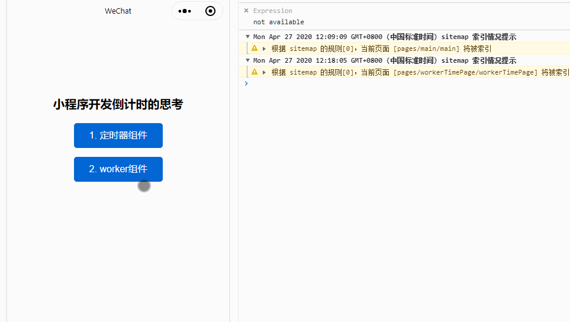

# 关于页面倒计时组件开发的思考

## 场景描述

前阵子公司的测试同学跟我说：**为什么xx页面每次进来或者返回的时候都要调一次接口，这个接口很慢，返回的时候不应该请求接口，这样很影响性能的。**

我心想也对，进来的时候请求接口了，当进入下一层页面，然后返回的话就不应该请求了，那是为什么呢？

因为页面存在倒计时计算，而倒计时的时间是从接口读取的，离开当前页面，倒计时是必须得清除掉的，原因是：

1. `js` 是 **单线程** 语言，倒计时事件会影响下一层页面主线程事件的调用，彼此相互影响 (EventLoop，这里不对此作阐述，有兴趣的同学自行搜索)

2. 本地和服务器的时间存在误差，返回页面需要重新获取服务器时间

## Web Workers

我们来试想一下，假设说不存在时间误差的情况下，是否可以让倒计时作为脚本文件存在后台，在不干扰主线程的前提下，稳定持续的运行，最后将结果反馈给主线程上来呢？

答案是可以的，那就是 [Web Workers](https://developer.mozilla.org/zh-CN/docs/Web/API/Web_Workers_API/Using_web_workers)。

我们来引用一下阮一峰老师的一段话：

> Web Worker 的作用，就是为 JavaScript 创造多线程环境，允许主线程创建 Worker 线程，将一些任务分配给后者运行。在主线程运行的同时，Worker 线程在后台运行，两者互不干扰。等到 Worker 线程完成计算任务，再把结果返回给主线程。这样的好处是，一些计算密集型或高延迟的任务，被 Worker 线程负担了，主线程（通常负责 UI 交互）就会很流畅，不会被阻塞或拖慢。

> Worker 线程一旦新建成功，就会始终运行，不会被主线程上的活动（比如用户点击按钮、提交表单）打断。这样有利于随时响应主线程的通信。但是，这也造成了 Worker 比较耗费资源，不应该过度使用，而且一旦使用完毕，就应该关闭。

## 实现

原生微信小程序在 `1.9.90` 版本之后已经支持 [Worker对象](https://developers.weixin.qq.com/miniprogram/dev/framework/workers.html)了，小程序文档的场景比较简单，我想结合一下近期的这个需求来写一个具体例子来解释一下。

1. 配置 Worker 信息
在 app.json 中可配置 Worker 代码放置的目录，目录下的代码将被打包成一个文件：

配置示例：

```js
// app.json
{
  "workers": "workers"
}
```

2. 项目根目录下创建 `workers` 目录，创建 `timeWorker.js` 文件

```js
// timeWorker.js
let inter = null

/**
 * 开始倒计时
 * @param {*} totalSeconds 
 */
const beginCountdown = (totalSeconds) => {     
  const [ days, hours, minutes, seconds ] = getTime(totalSeconds)

  // 向主线程组件传递信息
  worker.postMessage({
    days,
    hours,
    minutes,
    seconds,
  })

  inter = setInterval(() => {
    totalSeconds = totalSeconds - 1

    const [ days, hours, minutes, seconds ] = getTime(totalSeconds)

    if (totalSeconds <= 0) {
      clearTime()
    }

    // 向主线程组件传递信息
    worker.postMessage({
      days,
      hours,
      minutes,
      seconds,
      totalSeconds,
    })
  }, 1000)
}

/**
 * 获取日，时，分，秒
 * @param {*} totalSeconds 
 */
const getTime = (totalSeconds) => {
  const days = Math.floor(totalSeconds / 86400)
  const hours = Math.floor((totalSeconds / 3600) % 24)
  const minutes = Math.floor((totalSeconds / 60) % 60)
  const seconds = Math.floor(totalSeconds % 60)
  return [days, hours, minutes, seconds]
}

/**
 * 清除倒计时
 */
const clearTime = () => {
  inter && clearInterval(inter)
  inter = null
}

// 接收初始时间，开始倒计时
worker.onMessage((res) => {
  beginCountdown(res.remainSeconds)
})
```

3. 组件内部创建 `worker` 线程

```js
// workerTime.js
Component({
  properties: {
    label: {
      type: String,
      value: ''
    },
    remainSecond: {
      type: Number,
      value: 0,
      observer(newVal, oldVal) {
        if (newVal && newVal > 0) {
          this.worker = wx.createWorker('workers/timeWorker.js')

          // worker线程通信 - 发送
          this.worker.postMessage({
            remainSeconds: newVal
          })

          // worker线程通信 - 接收
          this.worker.onMessage((res) => {
            console.log("time:", res)
            this.setData({ ...res })
          })
        }
      }
    } 
  },

  detached() {
    this.worker.terminate()
  },
})
```

主要的逻辑代码在这里就基本结束了，这里就不贴多余的代码了，老规矩，文章末尾会贴出范例项目地址，以供大家调试；

回归文章的开篇，我们在小程序里面切换页面的时候，上一个页面有倒计时功能，由此引出提出对倒计时实现的思考。

在剩余时间没有受到外部因素影响的前提下，我们既想要保留倒计时在切换页面能稳定执行，又不能破坏 `js` 主流程下的事件调用顺序，影响到页面的 **UI渲染**；

于是我想是否可以引入 `Worker` 对象，将倒计时事件独立到一个子线程任务中处理，不受页面 `UI` 事件的影响，这样可以相对保证倒计时事件不出现延迟执行，避免出现误差。由于 `js` 单线程的特性，本质上子线程还是受主线程的控制调用。

## 注意事项

摘抄微信小程序的官方文档

> 1. Worker 最大并发数量限制为 1 个，创建下一个前请用 Worker.terminate() 结束当前 Worker
> 2. Worker 内代码只能 require 指定 Worker 路径内的文件，无法引用其它路径
> 3. Worker 的入口文件由 wx.createWorker() 时指定，开发者可动态指定 Worker 入口文件
> 4. Worker 内不支持 wx 系列的 API
> 5. Workers 之间不支持发送消息

## 示例展示



## 项目地址

项目地址：[https://github.com/csonchen/mina-app](https://github.com/csonchen/mina-app)

**我想记录一些关于小程序日常开发所遇到的问题，进而引起的一些思考，能否给大家提供多一些角度去思考问题，解决问题，能帮助大家就好。希望大家多多支持，多多star哈**